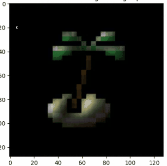

# Light Sprite
UNet Pixel Art Dynamic Light Generation

This repository contains the code for the paper "Light the Sprite: Pixel Art Dynamic Light Generation" for training a UNet-based deep learning model with Conditional instance normalization layers (CIN) for producing combined dynamic directional and point light map with normal map surface information.

| Point Light | Directional Light |
|-------------|-------------------|
|             |                   |
|             |                   |

# Requirements

- PyTorch >2.0, torchvision
- OpenCV
- Pillow
- Numpy

# Running

- To generate the necessary training and testing data with the correct structure first go to Generate Training Data -> and unzip the Dataset.zip
- Run the gen_phong_directional.py or gen_phong_positional.py to generate the necessary training and testing data. Data will be in the following file structure:

.
└── Outputs/
    └── image_*/
        ├── target_images/
        │   └── illum_*.jpg
        ├── angles.txt
        └── image_*.jpg

- To train the model run the train.py and if necessary change the input and model checkpoint directories
- To test the model on a specific image and the given angles or positions run test.py and change the necessary directories
- To get the SSIM measurements and the average run time for the testing images run test_measure.py
- To run the trained model in a real-time example application run the test_real_time.py. There you select if you are running a directional or positional light model and move the mouse to move the light's position and the model generates the necessary light/normals at runtime
